<div align="center">

  <!-- Animated Interactive Header Banner -->
  <a href="https://shastryassociates.com">
    
  </a>

  <br /><br />

  <!-- Master Brand Status Badges (Deep Blue, Sky Blue, Vibrant Orange) -->
  <a href="https://shastryassociates.com">
    
  </a>
  &nbsp;
  <a href="https://shastryassociates.com/team">
    
  </a>
  &nbsp;
  <a href="https://shastryassociates.com/courses">
    
  </a>
  &nbsp;
  <a href="mailto:info@shastryassociates.com">
    
  </a>

</div>

<br />

<p align="center">
  
</p>

## 📡 Institutional Charter

**Shastry Associates Global Enterprises (SAGE)** is a specialist engineering institute and advisory network dedicated to advancing knowledge in **applied electromagnetics, radio frequency (RF), microwave systems, and next-generation wireless communications**.

Founded and guided by international IEEE fellows, university chairs, and semiconductor industry veterans, SAGE bridges graduate-level theoretical rigor with practical laboratory bench verification.

```
  ┌────────────────────────────────────────────────────────────────────────────┐
  │  CORE PILLARS                                                              │
  │  • Mathematical Rigor: Exact field solutions, Maxwellian foundations       │
  │  • Bench Authenticity: VNA, spectrum analyzers, probe stations, link tests  │
  │  • Global Reach: Associates across USA, India, South Korea, and Europe     │
  └────────────────────────────────────────────────────────────────────────────┘
```

<br />

<p align="center">
  
</p>

## 🔬 Interactive Engineering Domains

Click on any engineering track below to explore technical specializations, laboratory benchmarks, and curriculum highlights:

<details open>
<summary><b>📡 1. Radio Frequency & Microwave Engineering</b></summary>
<br />

> **Focus:** High-frequency passive and active network analysis, impedance transformation, and transmission line theory.

* **Key Technical Topics:**
  * S-Parameter formulation and vector network analysis calibration techniques.
  * Planar transmission lines: Microstrip, Coplanar Waveguide (CPW), and Stripline design.
  * Advanced Smith Chart impedance matching, distributed filtering, and power combiners.
  * Waveguide discontinuities, cavity resonators, and dielectric loading.
* **Bench & Simulation Toolsets:** `Keysight ADS` • `AWR Microwave Office` • `VNA Bench Calibration (SOLT / TRL)`

</details>

<details>
<summary><b>📶 2. Applied Electromagnetics & Antenna Systems</b></summary>
<br />

> **Focus:** Radiation physics, wideband microstrip antennas, phased arrays, and beamforming networks.

* **Key Technical Topics:**
  * Computational Electromagnetics (CEM): Method of Moments (MoM), Finite Element Method (FEM), and FDTD.
  * Phased array beamforming, mutual coupling mitigation, and beam-steering architectures.
  * mmWave antenna-in-package (AiP) and ultra-wideband (UWB) radiating elements.
  * Anechoic chamber measurement standards, near-field to far-field transformations.
* **Bench & Simulation Toolsets:** `Ansys HFSS` • `CST Studio Suite` • `Far-Field Anechoic Chambers`

</details>

<details>
<summary><b>⚡ 3. High-Frequency Circuit Design & RFIC / MMIC</b></summary>
<br />

> **Focus:** Semiconductor device physics, power amplifiers, low-noise front-ends, and monolithic ICs.

* **Key Technical Topics:**
  * High-efficiency Power Amplifier (PA) design: Class-D, E, F, and Doherty topologies.
  * Low Noise Amplifiers (LNA) with minimum noise figure and optimal IIP3 trade-offs.
  * RFIC / MMIC architectures in Gallium Nitride (GaN), Gallium Arsenide (GaAs), and CMOS.
  * Non-linear distortion characterization, intermodulation, and thermal dissipation modeling.
* **Bench & Simulation Toolsets:** `Cadence Virtuoso` • `Keysight GoldenGate` • `Load-Pull Tuners`

</details>

<details>
<summary><b>🛰️ 4. Wireless Communication Systems & Physical Layer</b></summary>
<br />

> **Focus:** 5G NR, 6G research, satellite communications, and propagation channel modeling.

* **Key Technical Topics:**
  * Link budget derivations, atmospheric absorption attenuation, and Doppler shift profiling.
  * Massive MIMO, spatial multiplexing, and baseband-to-RF transceiver architectures.
  * Non-Terrestrial Networks (NTN) and Low Earth Orbit (LEO) satellite constellation links.
  * Radar system engineering: FMCW radar, synthetic aperture radar (SAR), and target RCS profiling.
* **Bench & Simulation Toolsets:** `MATLAB RF Toolbox` • `GNU Radio` • `Real-Time Spectrum Analyzers`

</details>

<br />

<p align="center">
  
</p>

## 🏛️ Educational Programs & Advisory Offerings

<div align="center">

| 🎓 Executive & Industry Training | 🏫 Academic Masterclasses | 💼 Technical Advisory & Consulting |
| :--- | :--- | :--- |
| Tailored on-site and remote multi-day intensive bootcamps for engineering teams in semiconductor, defense, aerospace, and telecom sectors. | Advanced semester-length and focused seminar modules bridging graduate academic curricula with live industry applications. | Expert peer review, antenna design optimization, system-level link budget analysis, and prototype measurement guidance. |
| [**Explore Corporate Programs →**](https://shastryassociates.com/services#training) | [**View Course Offerings →**](https://shastryassociates.com/courses) | [**Request Advisory Consultation →**](https://shastryassociates.com/services#consulting) |

</div>

<br />

<p align="center">
  
</p>

## 👥 International Faculty & Fellows Network

SAGE is supported by an international network of senior IEEE Fellows, professors, research scientists, and industrial technical directors across:

* 🇺🇸 **United States** — RFIC design leads, aerospace radar specialists, and university professors.
* 🇮🇳 **India** — Microwave engineering academics, microwave tube researchers, and defense laboratory advisors.
* 🇰🇷 **South Korea** — mmWave antenna researchers and semiconductor packaging pioneers.
* 🇪🇺 **Europe** — Electromagnetic compatibility (EMC) experts and satellite communication specialists.

👉 [**Browse the Full Faculty & Associates Directory**](https://shastryassociates.com/team)

<br />

<p align="center">
  
</p>

## 📬 Contact & Advisory Dispatch

<div align="center">

| Channel | Destination | Primary Purpose |
| :--- | :--- | :--- |
| 🌐 **Official Portal** | [shastryassociates.com](https://shastryassociates.com) | Program overviews, syllabus breakdowns, and institutional news |
| 👥 **Faculty Directory** | [shastryassociates.com/team](https://shastryassociates.com/team) | Specialist profiles, research interests, and publications |
| ✉️ **Direct Inquiries** | [info@shastryassociates.com](mailto:info@shastryassociates.com) | Corporate training proposals, masterclass enrollments, and consulting |

<br />

<a href="https://shastryassociates.com/contact">
  
</a>

<br /><br />

<sub>© 2026 Shastry Associates Global Enterprises, LLC (SAGE). All rights reserved.</sub>

</div>
